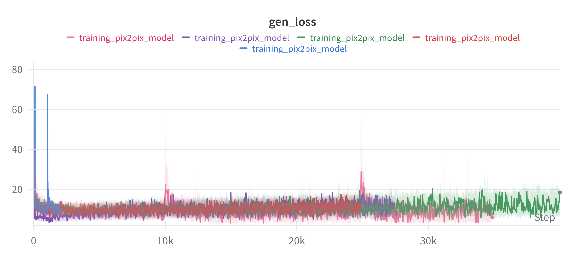
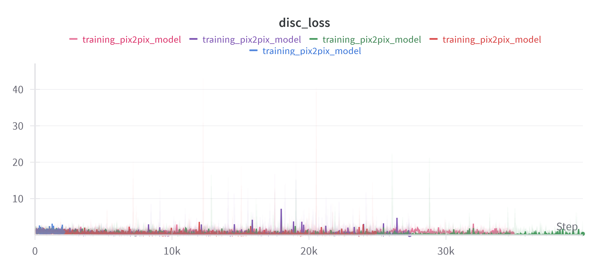
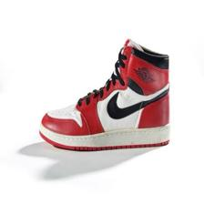
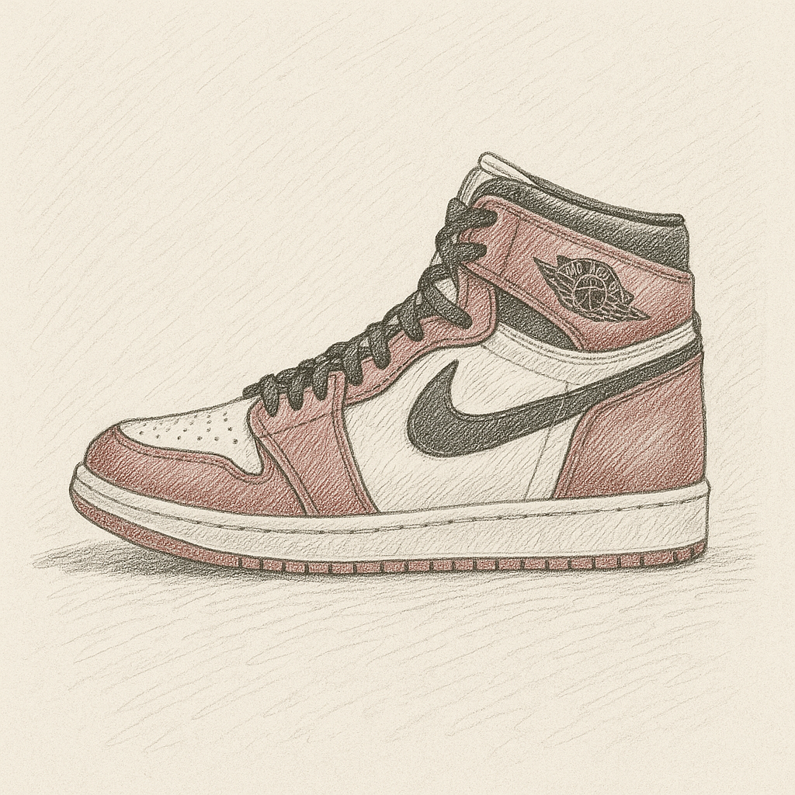
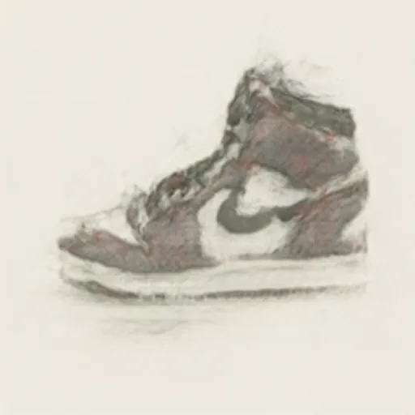

# Proyecto 02 - Generative Adversarial Network (pix2pix) con Fine-tuning en Tenis estilo Sketch

## Asignatura
**Aprendizaje profundo**

## Autores
- Luther Williams Sandria
- Juan Pablo Echeverría Villaseñor

---

## Introducción

Este proyecto describe el proceso de entrenamiento y ajuste fino (*fine-tuning*) de una Red Generativa Adversarial (GAN) basada en **pix2pix**.  
El objetivo fue transformar imágenes reales de tenis a un estilo de dibujo (*sketch*), utilizando transferencia de estilo para crear un dataset de pares (real → sketch). Posteriormente, entrenamos una GAN pix2pix para realizar la traducción de estilo de manera automática.

---

## Extracción y Preprocesamiento de Datos

- **Descarga de imágenes** de tenis mediante herramientas en Python.
- **Conversión a estilo sketch** usando transferencia de estilo asistida por ChatGPT y procesamiento de imágenes.
- **Preprocesamiento:**
  - Redimensionamiento de las imágenes a **256x256 px**.
- **División de datos** en conjuntos de entrenamiento, validación y prueba.

---

## ¿Qué es una GAN?

Una **Generative Adversarial Network (GAN)** consiste en dos redes que compiten:

- **Generador (G):** Trata de crear datos falsos que parezcan reales.
- **Discriminador (D):** Trata de distinguir entre datos reales y generados.

Ambas redes mejoran mutuamente mediante este juego de suma cero, generando datos de alta calidad.

---

## Arquitectura Utilizada: pix2pix

Pix2pix es una variante de GAN para **traducción de imágenes** de un dominio a otro utilizando imágenes pares:

- **Generador:** Traduce imágenes de entrada al dominio objetivo.
- **Discriminador:** Evalúa la autenticidad de las imágenes generadas.

---

## Fine-Tuning

Se utilizó un modelo de pix2pix preentrenado, realizando un ajuste fino específico para nuestro dataset de tenis:

- Ajuste de pesos finales utilizando nuestro conjunto de imágenes real → sketch.

---

## Entrenamiento

Durante el entrenamiento se monitorearon dos principales métricas:

- **Pérdida del Discriminador**
- **Pérdida del Generador**

Visualizaciones del entrenamiento registradas con **Weights & Biases:**

| Pérdida del Generador | Pérdida del Discriminador |
|:---------------------:|:-------------------------:|
|  |  |

Observaciones:
- El entrenamiento fue volátil debido al tamaño limitado del dataset.
- La convergencia se logró rápidamente gracias al preentrenamiento, aunque con capacidad limitada de mejora posterior.

---

## Resultados

Ejemplos de traducción **real → sketch**:

| Imagen Original | Sketch generado por ChatGPT | Sketch generado por pix2pix |
|:---------------:|:----------------------------:|:---------------------------:|
|  |  |  |

- El modelo logró un efecto de sketch aceptable aunque con bordes menos definidos que soluciones más complejas.

---

## Problemas Presentados

- **Falta de imágenes en el dataset:**  
  La limitación en el tamaño del conjunto de datos redujo la capacidad de aprendizaje y generalización del modelo.

---

## Conclusión

Se logró realizar una traducción efectiva de imágenes reales de tenis a estilo sketch usando una arquitectura **pix2pix** basada en **GANs**.  
El fine-tuning permitió especializar el modelo en el dominio deseado, y la calidad de los resultados fue validada visualmente.

---

## Referencias

- Phillip Isola, Jun-Yan Zhu, Tinghui Zhou, Alexei A. Efros.  
  "**Image-to-Image Translation with Conditional Adversarial Networks**."  
  *arXiv preprint arXiv:1611.07004, 2017.*  
  [https://arxiv.org/abs/1611.07004](https://arxiv.org/abs/1611.07004)
